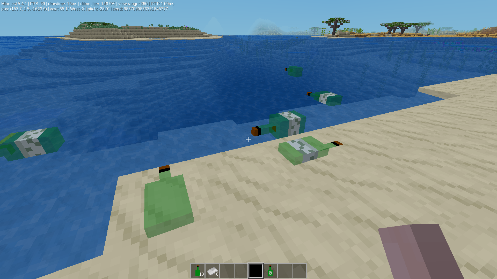

# Bottle Messages

Messages in bottles for Minetest

Author:  fiftysix/56

License: GPLV3

Screenshot:

Bottles can be crafted with:

    [glass], [              ], [glass]

    [glass], [dark-green dye], [glass]

    [     ], [    glass     ], [     ]

They can also be found occasionally washed up on beaches, and if enabled, these will also contain a random message.

Right click (in the air) with a bottle, and paper in your inventory, then write your message.

Place the bottle in the ocean, and it will roughly be carried by the tide in the direction it is facing.

The bottle will eventually wash up on land, where it can picked up, and read by right clicking (in the air) with is.

The written bottle can be crafted back into paper and an empty bottle.
