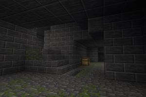

### STONEBRICK DUNGEONS
  
**_Turns newly generated cobblestone dungeons into stonebrick._**

**Version:** 0.4.1  
**License:** [EUPL v1.2][1] or later.

**Dependencies:** default, stairs (found [Minetest Game][2])

### Installation

Unzip the archive, rename the folder to stonebrick_dungeons and place it in  
../minetest/mods/

If you only want this to be used in a single world, place it in  
../minetest/worlds/WORLD_NAME/worldmods/

GNU+Linux - If you use a system-wide installation place it in  
~/.minetest/mods/

For further information or help see:  
https://wiki.minetest.net/Help:Installing_Mods

[1]: https://eur-lex.europa.eu/legal-content/EN/TXT/?uri=CELEX:32017D0863
[2]: https://github.com/minetest/minetest_game
